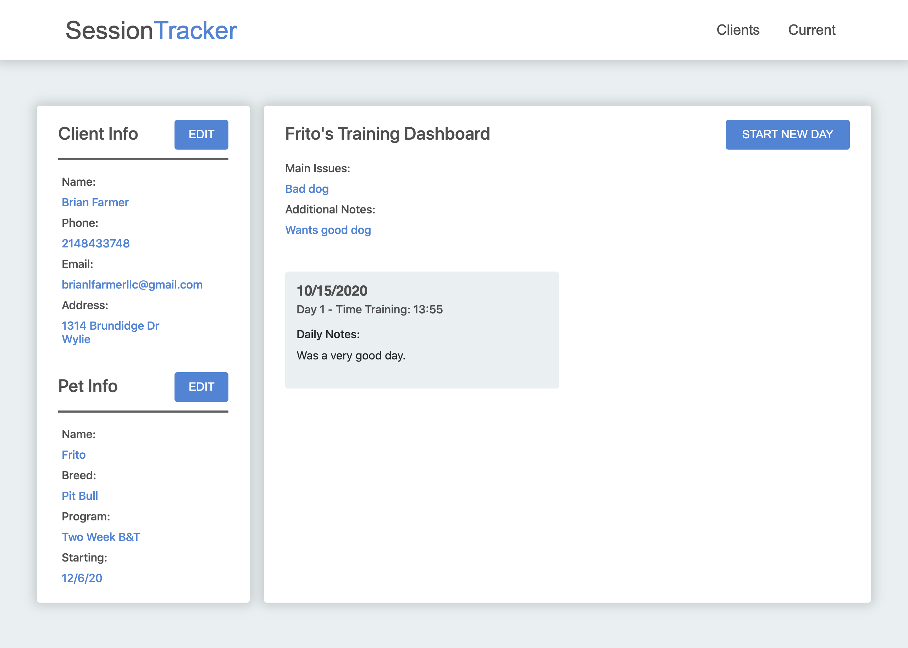

# MERN Stack - BFF K9 Training Client Management System

This is a duplicate of a project I built with the MERN stack for my wife to track client info and client training schedules for her dog training business.

## Table of contents

- [Overview](#overview)
- [The challenge](#the-challenge)
- [Screenshot](#screenshot)
- [Links](#links)
- [My process](#my-process)
- [Built with](#built-with)
- [What I learned](#what-i-learned)
- [Continued development](#continued-development)
- [Useful resources](#useful-resources)
- [Author](#author)

## Overview

### The challenge

The user should be able to:

- Create a new client with client info and pet information saved to MongoDB
- Add log of days training activities
- View client dashboard with pet training activity summary
- Perform (CRUD) Create, Read, Update, and Delete operations in dashboard on client info, pet info, and training activity

### Screenshot



### Links

- GitHub URL: [GitHub URL here](https://github.com/brianlfarmerllc/BFFK-9_Session_Tracker)
- Live Site URL: [Live site URL here](https://bffk9-session-tracker.herokuapp.com/)

## My process

### Built with

- MERN Stack
- MongoDB
- Express.Js
- React.Js
- Node.Js
- React Router Dom and History, State Management with React Hooks
- Moment.JS
- React-Time-Picker
- Semantic HTML5 markup
- CSS3 Styling
- Bootstrap 4
- Asynchronous fetch
- JSX Functionality

### What I learned

This project was a practice in working with React, more advanced state management with react hooks, server and database integration, various CRUD operations, as well as creating reusable components that are dynamically generated as the user adds aditional clients and training information.

Something that was important to the primary user of the application was to be able to log and track the time spent training the clients pets each day. As well as time spent on each type of training activity. I spent a lot of time learning about and creating client side functions to handle a lot of the time calculations working with the Date method and MomentJS. I also discovered that some of these calculations could be done using virtual attribute in the mongoose session schema.

```js
sessionSchema = new Schema(
  {
    day: { type: Date, required: true },
    training_block: [
      {
        start: { type: String },
        session_notes: { type: String },
        end: { type: String },
        sec: { type: Number },
        activity: { type: String },
      },
    ],
    days_notes: { type: String, default: "Record Notes on Todays Activities" },
    petId: { type: Schema.Types.ObjectId, ref: "Pet", required: true },
  },
  {
    toJSON: {
      virtuals: true,
    },
  }
);
// virtual attribute created to calculate total seconds spent training in a day
// data is sent back to client but not stored in the database.
sessionSchema.virtual("total_sec").get(function () {
  return this.training_block.reduce((total, training_block) => {
    return total + training_block.sec;
  }, 0);
});
```

### Continued development

After finishing the project and reviewing a lot of the code I am proud of what I was able to accomplish with my skill level at the time of the project. A few things that stand out to me that could be improved on would be to incorporate the use of additional virtual attributes to handle some of the calculations performend on the client side. I also feel like I have a lot left to learn on state management as it was a difficult to manage.

### Useful resources

- [Mongoose Virtuals](https://mongoosejs.com/docs/2.7.x/docs/virtuals.html) - Link to the Mongoose documentation on how to use virtual attributes.
- [React Time Picker](https://www.npmjs.com/package/react-time-picker) - I really like the look and functionality of this component to select time.

## Author

- Website - [Portfolio Site](https://brianfarmerwebdev.netlify.app)
- GitHub URL: - [GitHub URL](https://github.com/brianlfarmerllc)
